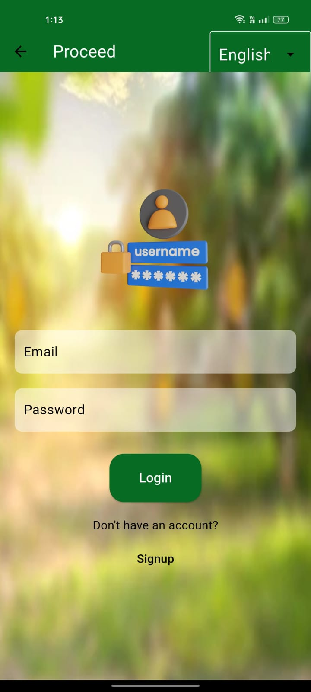

  

# Multilingual Mango Plant Disease Detection Mobile App

A Flutter-based multilingual mobile application for Mango Plant Disease Detection using Convolutional Neural Networks (CNN). This app provides a comprehensive solution for identifying mango plant diseases, their symptoms, treatments, generating PDF reports, and enabling user feedback to administrators.

## Features

- **Firebase Signup & Sign-In:** Securely register and log in with your email and password.

- **Image Pick & Capture:** Easily choose images from the gallery or capture them using the in-app camera.

- **Disease Identification:** Utilizes a CNN model to identify mango plant diseases and provide information about them.

- **Symptoms and Treatments:** Detailed information about the symptoms and suggested treatments for identified diseases.

- **PDF Report Generation:** Create PDF reports with disease images and relevant details.

- **Feedback to Admin:** Provide feedback to administrators to help improve the app.

- **API Deployment:** The backend API for disease detection is deployed on [Render.com](https://render.com). The API endpoints are accessible through this mobile app.

## Screenshots

